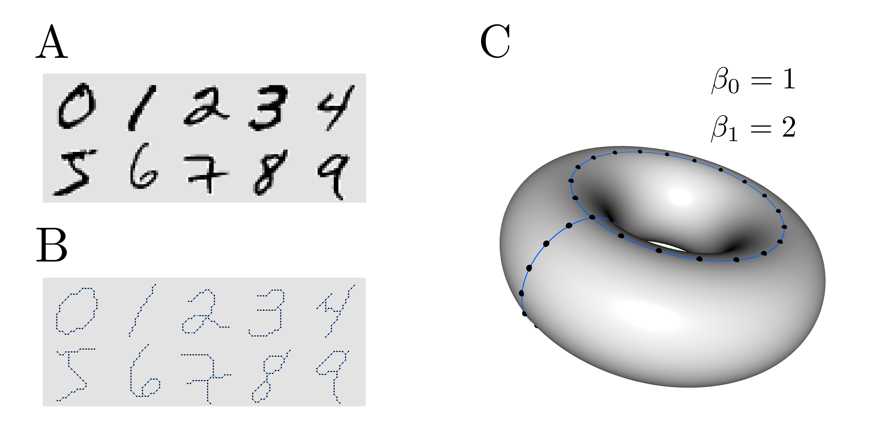

# Topological features applied to the MNIST data set

**Extraction of topological features that can be used as an input to standard algorithms to obtain qualitative geometric information**

<p align="center">

</p>

## Introduction

This repository contains the source code for a tutorial on application of computational topology in machine learning. To illustrate the use of persistent homology in machine learning we apply it to the MNIST data set of handwritten digits.

You can find the blog post <ins>[here](https://markolalovic.github.io/blog/tda-digits)</ins> or check the interactive example <ins>[here](https://markolalovic.github.io/tda-digits/)</ins>.

## Description

The main problem we are trying to solve is how to extract the topological features that can be used as an input to standard machine learning algorithms. We will use a similar approach as described in <ins>[[1]](https://arxiv.org/abs/1304.0530)</ins>.

From each image, we first construct a graph, where pixels of the image correspond to vertices of the graph and we add edges between adjacent pixels; see **Figure A** and **Figure B**. We then extract 0- and 1-dimensional topological features called Betti numbers. For example, a torus has one connected component so first Betti number is 1, and two cycles or loops so second Betti number is 2; see **Figure C**.

A pure topological classification cannot distinguish between individual numbers, as the numbers are topologically too similar. For example, numbers 6 and 9 are topologically the same if we use this style for writing numbers. Persistent homology, however, gives us more information.

The persistent homology was computed using computational topology package called Dionysus 2, for more see the package documentation <ins>[[2]](https://mrzv.org/software/dionysus2/)</ins>.


## How-to
Dependencies:

* Python (2 or 3);
* Dionysus 2 for computing persistent homology;
* Boost version 1.55 or higher for Dionysus 2;
* NumPy for loading data and computing;
* Scikit-learn for machine learning algorithms;
* Scikit-image for image pre-processing;
* Matplotlib for plotting;
* Networkx for plotting graphs.

To get the data run `scripts / prepare_data.py`:
```python
$ cd scripts
$ python3 prepare_data.py
```
This script downloads and saves 10000 images of digits to numpy arrays `X_10000.npy` and `y_10000.npy` in `data` directory.

To extract the features, run `src / tda_digits.py`:

```python
$ cd src
$ python3 tda_digits.py
```
This generates the figures for digit 8 that you can find in `example` directory.

For details on how to use the functions and classes see the Jupyter notebooks: `Example.ipynb` and `Classification.ipynb` that are in the `scripts` directory.

## References

[1] Aaron Adcock, Erik Carlsson, Gunnar Carlsson, "The Ring of Algebraic Functions on Persistence Bar Codes", Apr 2013.
[https://arxiv.org/abs/1304.0530](https://arxiv.org/abs/1304.0530)

[2] Dmitriy Morozov, "Dionysus 2 documentation".
[https://mrzv.org/software/dionysus2/](https://mrzv.org/software/dionysus2/)
