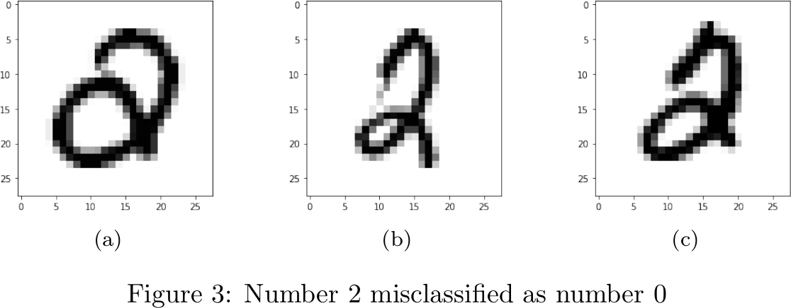

# tda-digits
An example to illustrate the use of computational topology in machine learning. In this case of distinguishing between images of handwritten digits. The aim of this example is to demonstrate the classification potential of the technique and not to outperform the existing machine learning algorithms for digit classification. For a more interesting example of using this technique on a clinical data set to classify hepatic lesions see [1]. The same approach can be applied to any point cloud data and can be generalized to higher dimensions than 2.

## Description
The main problem we are trying to solve is how to extract the topological features that can be used as an input to standard machine learning algorithms. We use a similar approach as described in [1].

From each image we first construct a graph, where pixels of the image correspond to vertices of the graph and we add edges between adjacent pixels.

A pure topological classification cannot distinguish between individual numbers, as the numbers are topologically too similar. For example numbers 1, 2 and 3 are topologically the same if we use this style for writing numbers. Persistent homology, however gives us more information.

We define a filtration on the vertices of the graph corresponding to the image pixels, adding vertices and edges as we sweep across the image in vertical or horizontal direction. This adds spatial information to the topological features. For example, though 6 and 9 both have a single loop, it will appear at different locations in the filtration.

We then compute the persistent homology given the simplex stream from the filtration to get the so-called Betti barcodes. The persistent homology was computed using computational topology package [Dionysus 2](https://github.com/mrzv/dionysus), for more about the package see [2].

Betti k barcode is a finite set of intervals. Each interval represents the first filtration level where the topological feature of dimension k appears and the filtration level where it disappears. This are called birth and death times of the topological feature.

A connected component (or connected cluster of points) is 0 dimensional feature and a cycle (or loop) is 1 dimensional feature.

We extract 4 features from k-dimensional barcode from the invariants discussed in [1]. For each of 4 sweep directions: top, bottom, right, left and dimensions 0 and 1 we compute 4 features. This gives us a total of 32 features per image. We extract the features from a set of images and then apply a support vector machine (SVM) to classify the images.

We show an example of applying this techinque on one image of a handwritten digit and then give the empirical classification results on a subset of the MNIST database.

## Extraction of topological features from handwritten digits
The preprocessing steps are shown in Figure 1.

The preprocessing steps are the following:

* Produce the binary image by thresholding.
* Reduce the binary image to a skeleton of 1 pixel width to expose its topology using the popular Zhang-Suen thinning algorithm.
* Transform the pixels of skeleton to points in the plane.
* Construct an embedded graph G in the plane where we treat the points as vertices and add edges between adjacent points similar and then remove all cycles of length 3. Intuitively, we connect the points while trying not to create new topological features.
* Construct a simplex stream for computing the persistent homology using the filtration on the vertices of the graph G. Filtration is the following. We are adding the vertices and edges of the embedded graph G as we sweep across the plane. In this example, we sweep across the plane to the top in vertical direction.

Given the simplex stream from the final preprocessing step we compute the persistent homology to get the so-called Betti barcodes shown in Figure 2.

We note that the Betti 0 barcode (the upper picture) clearly shows the single connected component with the birth time of 4.

The Betti 1 barcode shows two lines with birth times 12 and 20 corresponding to the births of 2 cycles (the value of y when the loop closes) in the drawing of number 8 when we sweep in y-direction across the plane to the top.

For each of 4 sweep directions: top, bottom, right, left and for each k-dimensional barcode, for k = 0, 1, we compute 4 features that take into account all of the bars, lengths and endpoints. This gives us a total of 32 features per image.

## Empirical classification results on a subset of the MNIST database

To create a data set for the input to a standard machine learning algorithm, we extracted topological features for 10000 images of handwritten digits. We split the data set 50:50 in train and test set so each one had 5000 examples and classified the images only based on extracted topological features using SVM with RBF kernel.

Accuracy on the train set using 10-fold cross validation was 0.88 (+/- 0.05). Accuracy on the test set was 0.89. We examined the common misclassifications. There were 3 examples of number 2 being mistaken for number 0 shown in Figure 3, because the number 2 was written with a loop.

For number 5 we got the lowest F1 score of 0.75. It was misclassified as 2 in 32 examples in test set. First 3 examples are shown in Figure 4. This was expected since these numbers are topologically the same with no topological features (e.g. loops) appearing in different different regions.

Number 8 was misclassfied as 4 in 21 examples from test set. First 3 examples are shown in Figure 5. From Figure 5 we see the stylistic problems that caused the missclassifications. The top loop of number 8 was not closed which made it topologically more similar to number 4 written with a loop.

## References

[1] Aaron Adcock, Erik Carlsson, Gunnar Carlsson, "The Ring of Algebraic Functions on Persistence Bar Codes", Apr 2013.
[https://arxiv.org/abs/1304.0530](https://arxiv.org/abs/1304.0530)

[2] Dmitriy Morozov, "Dionysus 2 documentation".
[https://mrzv.org/software/dionysus2/](https://mrzv.org/software/dionysus2/)
